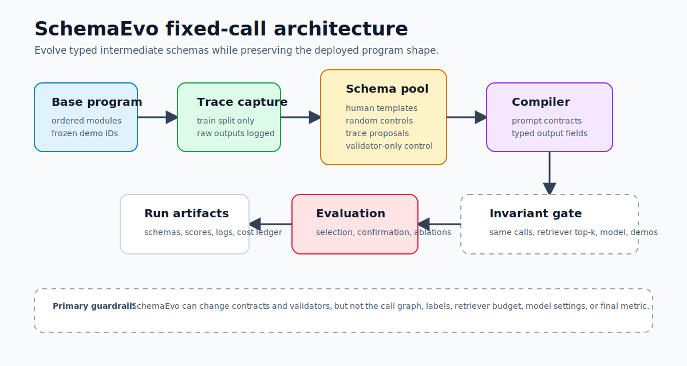
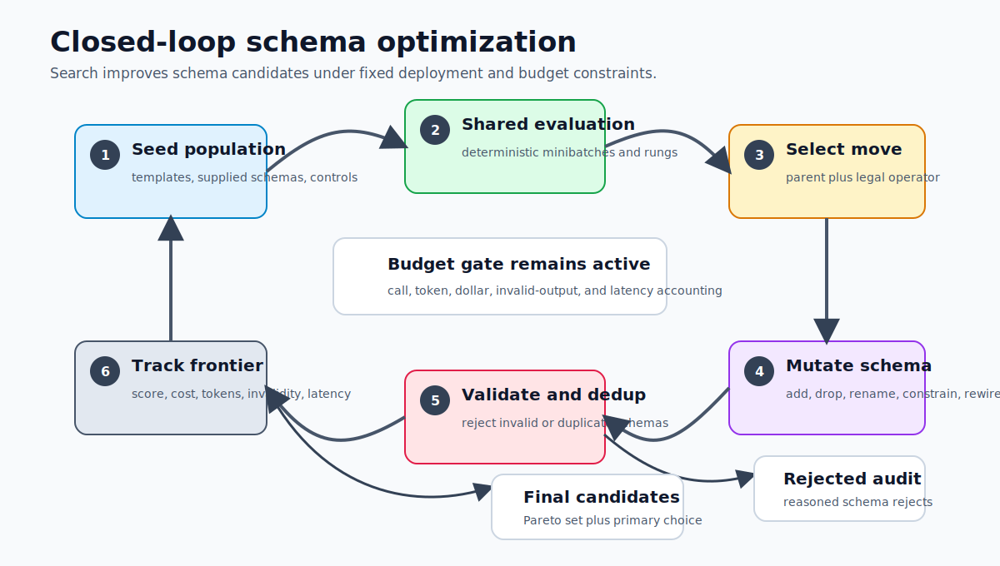

# SchemaEvo

Fixed-call schema evolution for multi-module LLM programs.

SchemaEvo optimizes the typed intermediate contracts between existing LLM
modules. It can add, remove, rename, type, validate, and route schema fields,
then teach downstream modules how to consume those fields. It does not change
the deployed call graph, target model, retriever budget, demo IDs, data splits,
or final metric.



The repository contains a local deterministic toy benchmark, a fixed-pool
optimizer, a closed-loop schema optimizer, OpenAI Responses API and DSPy
adapters, HotpotQA/HoVer loaders, cost/budget accounting, statistical reports,
and experiment drivers for causal pilots, composability, budget/Pareto reports,
and cross-model transfer.



## Current Status

Implemented:

- `LMProgram` and `ModuleSpec` abstractions for ordered multi-module programs.
- `SchemaCandidate`, typed fields, consumption rules, validators, and stable
  JSONL serialization.
- Fixed-pool SchemaEvo MVP with train-only proposals, human templates, random
  controls, validator-only controls, smoke/selection/confirmation/heldout
  stages, paired tests, Benjamini-Hochberg correction, and field ablations.
- Closed-loop SchemaEvo search with legal mutations, parent/operator allocation,
  optional successive halving, budget gates, rejected-schema audit records, and
  Pareto tracking.
- OpenAI Responses API module runner with strict structured JSON outputs.
- Optional OpenAI schema proposer for reflective train-trace-only proposals.
- DSPy adapter for wrapping DSPy-style callables as SchemaEvo modules.
- HotpotQA and HoVer local JSON/JSONL loaders, scorers, and readiness checks.
- Per-call logs, output payloads, score rows, rollout cache, cost ledgers,
  token/dollar/call caps, and progress renderers.
- CLI drivers and Make targets for toy runs, OpenAI fixed-pool runs, causal
  pilots, OpenAI closed-loop runs, composability, cross-model transfer, and
  budget/Pareto aggregation.

Not claimed here:

- This repository does not include a built-in GEPA or MIPRO implementation.
  The composability path expects an external prompt optimizer command.
- The CLI does not download benchmark data as part of real runs. HotpotQA helper
  scripts are provided, but benchmark files are treated as local inputs.
- The README does not claim benchmark-scale SOTA results. `PRE_REGISTRATION.md`
  defines the claim criteria and reporting requirements for those experiments.

## Installation

SchemaEvo requires Python 3.11 or newer.

```bash
python3 -m pip install -e '.[dev]'
```

For OpenAI-backed runs and tokenizer accounting:

```bash
python3 -m pip install -e '.[api,dev]'
export OPENAI_API_KEY=...
```

After an editable install, the `schemaevo` console script is available. All
examples below use `python3 -m schemaevo.cli` so they also work directly from a
source checkout.

## Quick Start: Local No-API Runs

Run tests:

```bash
python3 -m pytest -q
```

Run the deterministic fixed-pool toy benchmark:

```bash
python3 -m schemaevo.cli run-toy-mvp \
  --config configs/toy_schemaevo.yaml \
  --workers 2 \
  --progress auto \
  --out artifacts/toy_mvp
```

Run the deterministic closed-loop optimizer:

```bash
python3 -m schemaevo.cli run-toy-closed-loop \
  --config configs/toy_schemaevo.yaml \
  --progress auto \
  --out artifacts/toy_closed_loop
```

Equivalent Make targets:

```bash
make test
make run-toy-mvp
make run-toy-closed-loop
```

The toy task is intentionally small and deterministic. It exercises the full
SchemaEvo machinery without external APIs or downloaded benchmark data.

## How SchemaEvo Works

### Program Boundary

The core runtime object is `LMProgram`:

- A program has ordered `ModuleSpec` modules.
- Each module declares input fields, output fields, prompt text, model,
  `max_output_tokens`, target LLM call count, retriever call count, and optional
  demo IDs.
- A module runner returns a JSON-like dictionary.
- SchemaEvo compiles a candidate by appending a marked schema contract block to
  module prompts and extending output signatures with evolved fields.

The compiler clones the base program, preserves model settings and output-token
caps, and only extends module output signatures with schema fields. The
invariant check then verifies the deployment call graph: module order, LLM call
counts, retriever call counts, retriever top-k, and demo IDs remain unchanged.

### Fixed-Pool Path

`run_fixed_pool_schema_mvp` follows a frozen-candidate evaluation protocol:

1. Validate that schema proposal traces are train-only and split IDs do not
   overlap.
2. Build a schema pool from trace proposals, random controls, task templates,
   and a validator-only control.
3. Run static grammar and token-budget checks.
4. Compile every surviving candidate into the fixed program boundary.
5. Evaluate a baseline on the selection split.
6. Optionally smoke-test schema validity.
7. Evaluate candidates on the selection split.
8. Rank by lower confidence bound, with cost and invalidity penalties.
9. Confirm the top candidates on a held-out confirmation split.
10. Treat the selection-ranked top candidate as the primary candidate.
11. Run paired bootstrap, approximate randomization, and optional
    Benjamini-Hochberg correction.
12. Optionally evaluate the primary schema on a third held-out test split.
13. Run field mask, blank, shuffle, and downstream-disabled ablations.

### Closed-Loop Path

`schema_evo_optimize` searches rather than evaluating a frozen pool:

- Seeds a population from supplied schemas, human templates, and random
  controls.
- Samples deterministic shared minibatches.
- Compiles and evaluates candidates under the same call-graph invariant.
- Selects parents with `uniform_top_k`, `ucb`, or `thompson`.
- Samples legal mutation operators such as add/drop/rename field, change type,
  split/merge fields, tighten/relax validators, move producer modules, and add
  or remove downstream consumption rules.
- Optionally promotes candidates through successive-halving rungs.
- Tracks a Pareto frontier over score, cost, tokens, invalidity, and latency.
- Writes rejected-schema audit records with reasons.

Forbidden mutations include adding LLM calls, adding retrieval calls, increasing
retriever top-k, adding self-consistency, adding tools, exposing labels or gold
evidence, changing the final metric, changing the target model, or changing data
splits.

## CLI Reference

Show the available commands:

```bash
python3 -m schemaevo.cli --help
```

Commands:

| Command | Purpose |
| --- | --- |
| `run-toy-mvp` | Local deterministic fixed-pool demo. |
| `run-toy-closed-loop` | Local deterministic closed-loop demo. |
| `check-benchmark-readiness` | Check API packages, `OPENAI_API_KEY`, dataset readability, split quality, and context coverage. |
| `run-openai-fixed-pool` | Run fixed-pool SchemaEvo on local HotpotQA, HoVer, or MuSiQue files with OpenAI module runners. |
| `run-openai-causal-pilot` | Run a fixed-pool pilot and write causal field-ablation plus deployment-invariance reports. |
| `run-openai-closed-loop` | Run closed-loop SchemaEvo on local HotpotQA, HoVer, or MuSiQue files with OpenAI module runners. |
| `run-openai-composability` | Run an external prompt optimizer first, then SchemaEvo as an additive schema layer. |
| `run-openai-cross-model-transfer` | Optimize on one model, transfer the chosen schema, and evaluate it on another model. |
| `write-budget-pareto-report` | Aggregate completed run summaries into JSON, CSV, and Markdown budget/Pareto reports. |

Progress rendering is controlled with `--progress {auto,rich,tqdm,none}`.
Progress output goes to stderr so stdout remains JSON. Independent fixed-pool
candidates can run in separate processes with `--workers N`; budget-capped runs
stay serial so hard gates remain exact.

## OpenAI Benchmark Workflow

Install API dependencies and set credentials:

```bash
python3 -m pip install -e '.[api,dev]'
export OPENAI_API_KEY=...
```

Strict OpenAI fixed-pool runs require:

- `OPENAI_API_KEY`.
- The `openai` package.
- The `tiktoken` package.
- `--use-tiktoken-costing`.
- Nonzero input and output prices for the selected model.
- A price source/date label.
- Local data with full question/claim, answer/label, context coverage, and no
  overlapping example IDs across runtime splits.

Run readiness checks:

```bash
python3 -m schemaevo.cli check-benchmark-readiness \
  --hotpotqa /path/to/hotpotqa.json \
  --hover /path/to/hover.jsonl \
  --musique /path/to/musique.json \
  --strict
```

Strict fixed-pool readiness also checks that split paths do not visibly conflict
with `--dataset`; for example, `--dataset hotpotqa --train data/musique/train.json`
fails before any API calls. Use `--dataset musique` for MuSiQue pilots.

If you need a cheap HotpotQA pilot split, use one of the helper scripts:

```bash
python3 -m pip install datasets
python3 scripts/fetch_hotpotqa_hf.py
```

or, from an already-downloaded HotpotQA distractor JSON file:

```bash
python3 scripts/make_pilot_splits.py /path/to/hotpot_dev_distractor_v1.json
```

Both scripts write:

- `data/hotpotqa/train.json`
- `data/hotpotqa/selection.json`
- `data/hotpotqa/confirmation.json`

Run a small causal pilot:

```bash
python3 -m schemaevo.cli run-openai-causal-pilot \
  --config configs/pilot_hotpotqa_gpt41mini.yaml \
  --dataset hotpotqa \
  --train data/hotpotqa/train.json \
  --selection data/hotpotqa/selection.json \
  --confirmation data/hotpotqa/confirmation.json \
  --model gpt-4.1-mini \
  --use-tiktoken-costing \
  --input-price-per-million <input_price> \
  --output-price-per-million <output_price> \
  --price-source-date <price_source_date> \
  --out artifacts/causal_pilot_hotpotqa
```

Run the same causal pilot shape on MuSiQue:

```bash
python3 -m schemaevo.cli run-openai-causal-pilot \
  --config configs/pilot_musique_gpt41mini.yaml \
  --dataset musique \
  --train data/musique/train.json \
  --selection data/musique/selection.json \
  --confirmation data/musique/confirmation.json \
  --model gpt-4.1-mini \
  --use-tiktoken-costing \
  --input-price-per-million <input_price> \
  --output-price-per-million <output_price> \
  --cached-input-price-per-million <cached_input_price> \
  --price-source-date <price_source_date> \
  --max-dollar-cost <cap> \
  --out artifacts/causal_pilot_musique
```

Run a full fixed-pool benchmark path:

```bash
python3 -m schemaevo.cli run-openai-fixed-pool \
  --config configs/mvp_hotpotqa_gpt41mini.yaml \
  --dataset hotpotqa \
  --train /path/to/train.json \
  --smoke /path/to/smoke.json \
  --selection /path/to/selection.json \
  --confirmation /path/to/confirmation.json \
  --heldout /path/to/heldout.json \
  --model gpt-4.1-mini \
  --use-tiktoken-costing \
  --input-price-per-million <input_price> \
  --output-price-per-million <output_price> \
  --cached-input-price-per-million <cached_input_price> \
  --price-source-date <price_source_date> \
  --max-dollar-cost <cap> \
  --workers 4 \
  --out artifacts/openai_fixed_pool_hotpotqa
```

For HoVer, switch `--dataset hover`, use `configs/mvp_hover_gpt41mini.yaml`,
and provide HoVer-shaped local files. For MuSiQue, switch `--dataset musique`,
use `configs/mvp_musique_gpt41mini.yaml`, and provide MuSiQue files with either
Hotpot-style `context` or native `paragraphs`.

Run closed-loop SchemaEvo on local benchmark files:

```bash
python3 -m schemaevo.cli run-openai-closed-loop \
  --config configs/toy_schemaevo.yaml \
  --dataset hover \
  --optimizer /path/to/optimizer.jsonl \
  --confirmation /path/to/confirmation.jsonl \
  --heldout /path/to/heldout.jsonl \
  --model gpt-4.1-mini \
  --use-tiktoken-costing \
  --input-price-per-million <input_price> \
  --output-price-per-million <output_price> \
  --price-source-date <price_source_date> \
  --out artifacts/openai_closed_loop_hover
```

The closed-loop command reads the `closed_loop` block from the config when
present. If that block is absent, dataclass defaults are used after CLI
overrides.

## External Prompt Optimizer Composability

SchemaEvo does not implement GEPA or MIPRO internally. Instead, the
composability command runs an external optimizer command and then runs
SchemaEvo on the optimized prompts.

```bash
python3 -m schemaevo.cli run-openai-composability \
  --config configs/toy_schemaevo.yaml \
  --dataset hotpotqa \
  --schema-optimizer /path/to/schema_optimizer_split.json \
  --eval /path/to/eval_split.json \
  --model gpt-4.1-mini \
  --prompt-optimizer-name gepa \
  --prompt-optimizer-command "python /path/to/run_gepa_bridge.py" \
  --use-tiktoken-costing \
  --input-price-per-million <input_price> \
  --output-price-per-million <output_price> \
  --price-source-date <price_source_date> \
  --out artifacts/gepa_plus_schemaevo_hotpotqa
```

The external command receives:

- `SCHEMAEVO_PROMPT_OPTIMIZER`
- `SCHEMAEVO_INPUT_PROGRAM`
- `SCHEMAEVO_OUTPUT_PROGRAM`

It must read the input program JSON, write the output program JSON, and preserve
the deployment graph. By default demo IDs must also remain unchanged. Pass
`--allow-demo-changes` only when the comparison should permit demo changes while
still preserving the deployment graph.

## Cross-Model Transfer

Optimize a schema on a source model, compile the selected schema into a target
model program, and evaluate transfer retention:

```bash
python3 -m schemaevo.cli run-openai-cross-model-transfer \
  --config configs/mvp_hotpotqa_gpt41mini.yaml \
  --dataset hotpotqa \
  --train /path/to/train.json \
  --selection /path/to/selection.json \
  --confirmation /path/to/confirmation.json \
  --heldout /path/to/heldout.json \
  --source-model gpt-4.1-mini \
  --target-model <target_model> \
  --use-tiktoken-costing \
  --input-price-per-million <input_price> \
  --output-price-per-million <output_price> \
  --price-source-date <price_source_date> \
  --out artifacts/cross_model_transfer_hotpotqa
```

## Budget and Pareto Reports

Aggregate completed summary files:

```bash
python3 -m schemaevo.cli write-budget-pareto-report \
  --run baseline=artifacts/baseline/results/summary.json \
  --run schemaevo=artifacts/openai_fixed_pool_hotpotqa/results/mvp_summary.json \
  --out artifacts/budget_pareto
```

This writes:

- `budget_pareto_report.json`
- `budget_pareto_report.csv`
- `budget_pareto_report.md`

## Data Formats

The HotpotQA and HoVer loaders accept JSON or JSONL. JSON files may be:

- A list of records.
- A dictionary with `data`, `examples`, or `records`.
- A dictionary keyed by split names such as `train`, `smoke`, `selection`,
  `confirmation`, `heldout_validation`, or `test`.

HotpotQA records should contain:

- `_id` or `id`
- `question`
- `answer` or `gold`
- `context`

HoVer records should contain:

- `uid` or `id`
- `claim` or `question`
- `label`, `gold`, or `answer`
- `evidence`, `context`, or `documents`

Runtime split mapping:

| Runtime split | Source key preference |
| --- | --- |
| `train` | `train` |
| `validation_smoke` | `smoke` |
| `validation_selection` | `selection` |
| `validation_confirmation` | `confirmation` |
| `optimizer_validation` | `optimizer_validation` |
| `heldout_validation` | `heldout_validation` |
| `final_test` | `heldout_validation`, then `test` |
| `readiness` | `selection`, `validation`, `dev`, `train`, `test`, `heldout_validation` |

Readiness checks reject duplicate IDs, missing questions/claims, missing
targets, contextless files, and overlapping example IDs across supplied splits.
Use `--allow-contextless` only for smoke development, not for benchmark claims.

## Artifacts

Artifact directories are designed for audit and later aggregation.

Common fixed-pool outputs:

| Path | Contents |
| --- | --- |
| `schemas/frozen_pool.jsonl` | Frozen schema candidates that survived static checks. |
| `results/mvp_summary.json` | Main fixed-pool summary, decision, stats, cost, budget, control-schema guardrail, field ablations, and artifact paths. |
| `results/*_scores.jsonl` | Per-example scores, final outputs, validity, calls, tokens, cost, and latency. |
| `logs/*.jsonl` | Per-module call logs with prompt/schema hashes, validation data, token counts, and payload paths. |
| `payloads/<run>/<example>/<module>.json` | Raw module outputs. |
| `cost_ledgers/*.jsonl` | Per-call cost ledger entries. |
| `rollout_cache/*.json` | Content-addressed cached predictions keyed by program/schema/runtime metadata, full example payload, seed, and intervention. |

Closed-loop outputs:

| Path | Contents |
| --- | --- |
| `results/schemaevo_summary.json` | Search config, final schema IDs, rejected schemas, operator weights/counts, and budget summary. |
| `logs/*.jsonl` | Baseline and candidate call logs. |
| `payloads/` | Raw module outputs. |
| `rollout_cache/` | Cached optimizer rollouts. |

Experiment reports:

| Driver | Outputs |
| --- | --- |
| `run-openai-causal-pilot` | `causal_pilot_report.json`, `causal_pilot_report.md`, `deployment_invariance_report.json`, `deployment_invariance_report.md`, plus nested fixed-pool artifacts. |
| `run-openai-composability` | `composability_summary.json`, prompt-optimizer input/output program specs, and nested SchemaEvo artifacts. |
| `run-openai-cross-model-transfer` | `cross_model_transfer_report.json`, `cross_model_transfer_report.md`, and source/target evaluation artifacts. |
| `write-budget-pareto-report` | JSON, CSV, and Markdown budget/Pareto report files. |

Fixed-pool summaries include `control_guardrail`. If `primary_is_control` is
true, the selected primary is a random or validator-only control rather than a
designed schema; causal pilot reports surface this as
`empirical_status: control_selected_as_primary` and should be treated as a null
schema signal.

## Configuration

Configs are YAML mappings. The main sections are:

| Section | Used by | Notes |
| --- | --- | --- |
| `fixed_pool` | Toy MVP, OpenAI fixed-pool, causal pilot, cross-model transfer | Parsed into `FixedPoolConfig`. |
| `closed_loop` or `schema_evo` | Toy closed-loop, OpenAI closed-loop, composability | Parsed into `SchemaEvoConfig`. |
| `proposer` | Fixed-pool paths | `kind: heuristic` or `kind: openai`; also controls proposer model, temperature, target temperature, and max output tokens. |
| Split counts | Benchmark drivers | `train_examples`, `smoke_examples`, `selection_examples`, `confirmation_examples`, and `heldout_test_examples` limit loaded examples. |
| `retriever_top_k` | OpenAI benchmark program builder | Sets metadata and retriever-call accounting for the fixed two-module benchmark program. |

Included configs:

- `configs/toy_schemaevo.yaml`: deterministic local fixed-pool and closed-loop
  defaults.
- `configs/pilot_hotpotqa_gpt41mini.yaml`: cheap HotpotQA causal pilot
  template with a dollar cap.
- `configs/mvp_hotpotqa_gpt41mini.yaml`: OpenAI HotpotQA fixed-pool template.
- `configs/mvp_hover_gpt41mini.yaml`: OpenAI HoVer fixed-pool template.
- `configs/pilot_musique_gpt41mini.yaml`: cheap MuSiQue causal pilot template.
- `configs/mvp_musique_gpt41mini.yaml`: OpenAI MuSiQue fixed-pool template.

Token accounting defaults to a deterministic local proxy. For production
accounting, install the API extra and pass `--use-tiktoken-costing`. For schema
token-budget checks that call `approximate_token_count` directly, you can also
set:

```bash
export SCHEMAEVO_USE_TIKTOKEN=1
```

## Python API

The public package exports the schema dataclasses and optimizer entry points:

```python
from schemaevo import (
    FixedPoolConfig,
    SchemaEvoConfig,
    run_fixed_pool_schema_mvp,
    schema_evo_optimize,
)
from schemaevo.examples.toy_multihop import (
    build_toy_program,
    make_toy_examples,
    make_toy_traces,
    toy_scorer,
)

fixed_pool_result = run_fixed_pool_schema_mvp(
    base_program=build_toy_program(),
    train_traces=make_toy_traces(),
    smoke_examples=make_toy_examples("validation_smoke", 4),
    selection_examples=make_toy_examples("validation_selection", 12),
    confirmation_examples=make_toy_examples("validation_confirmation", 20),
    scorer=toy_scorer,
    config=FixedPoolConfig(task="toy_multihop", target_model="toy-model"),
    artifact_dir="artifacts/python_fixed_pool",
)

closed_loop_result = schema_evo_optimize(
    base_program=build_toy_program(),
    examples=make_toy_examples("optimizer_validation", 24),
    scorer=toy_scorer,
    config=SchemaEvoConfig(task="toy_multihop"),
    artifact_dir="artifacts/python_closed_loop",
)
```

Useful lower-level modules:

| Module | Purpose |
| --- | --- |
| `schemaevo.programs.base` | `LMProgram`, `ModuleSpec`, execution context, predictions. |
| `schemaevo.programs.compile_schema_program` | Compile schema contracts into a base program. |
| `schemaevo.programs.call_graph` | Extract and assert deployment invariants. |
| `schemaevo.schemas.*` | Candidates, grammar, mutations, validators, templates, proposers, serialization. |
| `schemaevo.eval.*` | Evaluation, logging, stats, cache, cost ledger, budgeting, ablations. |
| `schemaevo.adapters.openai` | OpenAI Responses API module adapter. |
| `schemaevo.adapters.dspy` | DSPy-style callable adapter. |
| `schemaevo.datasets.*` | HotpotQA/HoVer loaders and scorers. |
| `schemaevo.experiments.*` | Causal pilot, deployment invariance, composability, transfer, and budget/Pareto drivers. |

## Validation and Safety Invariants

SchemaEvo enforces the following safeguards in code:

- Schema proposal traces must come from the train split.
- Runtime example IDs cannot overlap across train traces, smoke, selection,
  confirmation, and heldout test examples.
- Static schema checks enforce allowed modules, allowed field types, token
  budgets, field count limits, snake_case field names, and known consumers.
- Candidate programs must preserve the base call graph and demo IDs unless a
  composability run explicitly allows demo changes.
- Validation uses Pydantic models plus executable constraints such as
  `non_empty`, `regex`, numeric `min`/`max`, `max_tokens`, `max_items`, and
  `one_of`.
- Validation can use deterministic type coercion. It does not perform uncounted
  LLM repair.
- Invalid outputs score as zero when `strict_invalid_policy` is enabled.
- Field ablations are run after selection and are reported as causal evidence,
  not used as a selection bonus in the fixed-pool MVP.
- Selection chooses a pre-committed primary candidate from the selection split.
  The post-hoc best confirmation candidate is reported separately.

## Repository Layout

```text
schemaevo/
  adapters/       OpenAI and DSPy adapters
  benchmarks/     OpenAI benchmark builders and readiness checks
  datasets/       HotpotQA/HoVer loaders and scorers
  eval/           scoring, logging, stats, cache, costs, budgeting, ablations
  examples/       deterministic toy multi-hop program
  experiments/    causal pilot, composability, transfer, budget/Pareto reports
  optimizers/     fixed-pool and closed-loop SchemaEvo optimizers
  programs/       LMProgram boundary, compiler, call-graph checks
  schemas/        candidates, grammar, mutations, validators, proposers
  utils/          progress rendering
configs/          toy, pilot, and OpenAI MVP config templates
docs/images/      architecture diagrams used by this README
scripts/          HotpotQA split preparation helpers
tests/            core regression tests
```

## Development

Compile and test:

```bash
make compile
make test
```

Clean the default toy artifact directory:

```bash
make clean-artifacts
```

Run one command through Make with overrides:

```bash
make run-openai-fixed-pool \
  CONFIG=configs/mvp_hotpotqa_gpt41mini.yaml \
  DATASET=hotpotqa \
  TRAIN=/path/to/train.json \
  SELECTION=/path/to/selection.json \
  CONFIRMATION=/path/to/confirmation.json \
  HELDOUT=/path/to/heldout.json \
  MODEL=gpt-4.1-mini \
  USE_TIKTOKEN=1 \
  INPUT_PRICE_PER_MILLION=<input_price> \
  OUTPUT_PRICE_PER_MILLION=<output_price> \
  PRICE_SOURCE_DATE=<price_source_date> \
  OUT=artifacts/openai_fixed_pool_hotpotqa
```

## Troubleshooting

- `OPENAI_API_KEY is required`: set `OPENAI_API_KEY` before OpenAI proposer or
  module-runner paths.
- `strict OpenAI fixed-pool runs require tiktoken costing`: pass
  `--use-tiktoken-costing` and install `.[api]`.
- `missing pricing table`: pass `--input-price-per-million`,
  `--output-price-per-million`, and `--price-source-date`, or configure
  `fixed_pool.model_prices`.
- `context coverage ... < 1.0`: the readiness checker found question/answer-only
  data. Use full-context files for benchmark claims.
- `example IDs overlap`: split files reuse example IDs. Re-slice the data before
  running fixed-pool experiments.
- Parallel fixed-pool evaluation is disabled when hard budget caps are active.
  This is expected; exact cap enforcement is serial.

## Pre-Registration

`PRE_REGISTRATION.md` defines the intended benchmark claim, primary tasks,
metrics, split discipline, budget points, win/tie/fail rules, causal pilot
criteria, and reporting requirements. Treat it as the experiment contract before
claiming benchmark-scale results.
